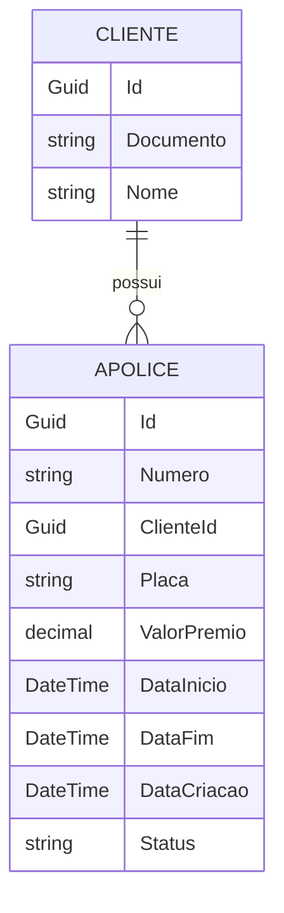
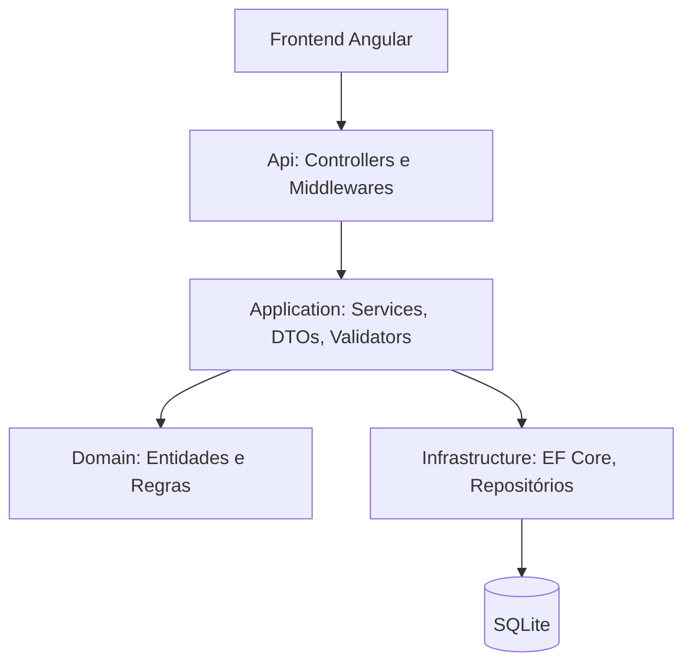
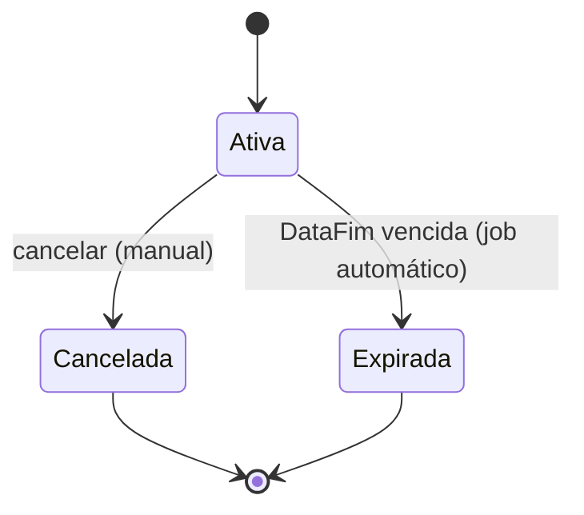
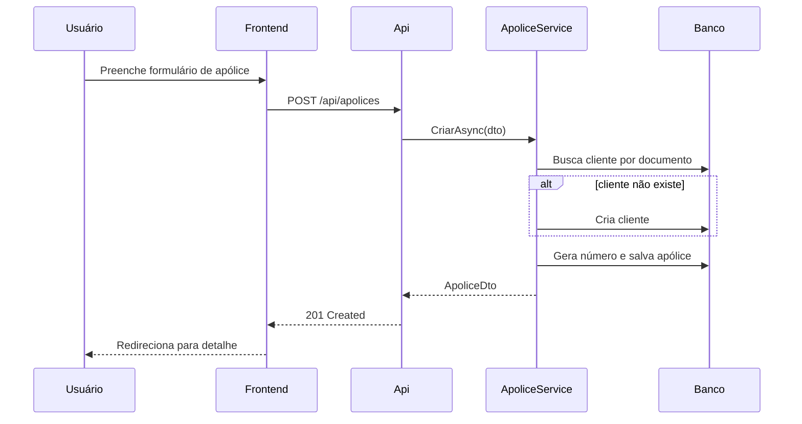
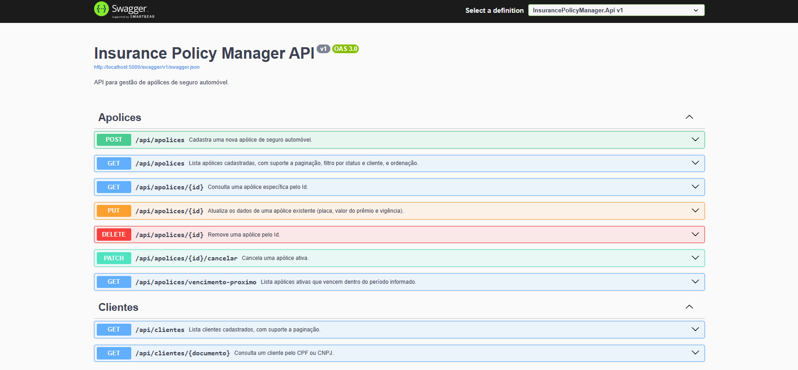
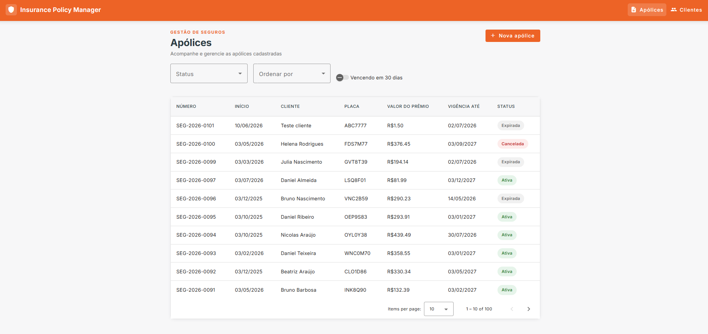
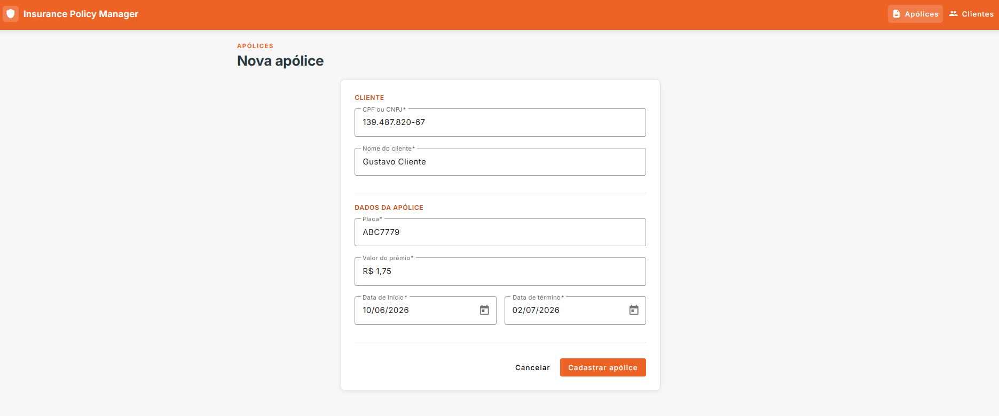
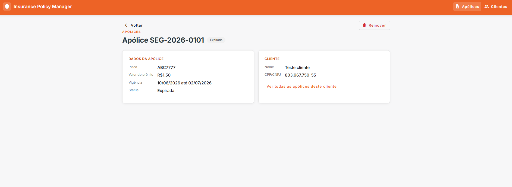
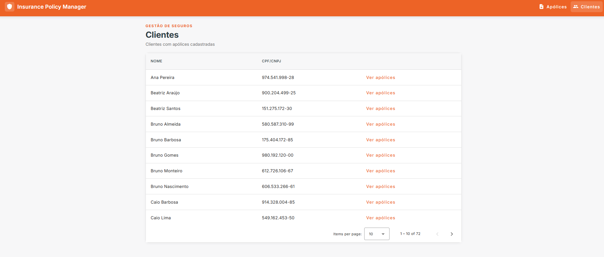

# Insurance Policy Manager

Sistema de gestão de apólices de seguro automóvel, com backend em .NET, persistência relacional, testes automatizados e frontend em Angular. O projeto foi construído com foco em organização de código, separação de responsabilidades e boas práticas de engenharia de software.

<p align="center">
  
</p>

---

## Índice

- [Sobre o projeto](#sobre-o-projeto)
- [Diferenciais](#diferenciais)
- [Tecnologias utilizadas](#tecnologias-utilizadas)
- [Arquitetura](#arquitetura)
- [Estrutura de pastas](#estrutura-de-pastas)
- [Modelo de dados](#modelo-de-dados)
- [Diagramas](#diagramas)
- [Regras de negócio](#regras-de-negócio)
- [Decisões técnicas](#decisões-técnicas)
- [Como executar](#como-executar)
- [Endpoints da API](#endpoints-da-api)
- [Filtros e ordenação](#filtros-e-ordenação)
- [Testes](#testes)
- [Coleção Postman](#coleção-postman)
- [Capturas de tela](#capturas-de-tela)
- [Deploy](#deploy)
- [Documentação adicional](#documentação-adicional)
- [Checklist de desenvolvimento](#checklist-de-desenvolvimento)
- [Contato](#contato)

---

## Sobre o projeto

A aplicação permite o cadastro, consulta, atualização e exclusão de apólices de seguro automóvel, contemplando as seguintes informações:

- Número da apólice, gerado automaticamente no padrão `SEG-YYYY-XXXX`;
- Cliente segurado (CPF/CNPJ e nome), vinculado à apólice;
- Placa do veículo;
- Valor do prêmio (valor mensal pago pelo cliente);
- Data de início e data de término da vigência;
- Status da apólice (`Ativa`, `Cancelada`, `Expirada`).

Além do CRUD principal, a aplicação disponibiliza uma consulta dedicada para listar apólices que vencem nos próximos 30 dias, recurso pensado para apoiar rotinas de acompanhamento e renovação.

---

## Diferenciais

- Arquitetura em camadas (Clean Architecture simplificada), com regras de negócio isoladas de detalhes de infraestrutura
- Modelagem relacional com `Cliente` e `Apólice`, evitando duplicidade de dados
- Validações desacopladas com FluentValidation
- Tratamento centralizado de erros via middleware global de exceções
- Respostas padronizadas em toda a API
- Logs estruturados com Correlation ID por requisição
- Health Check dedicado (`/health`)
- Testes unitários focados em regras de negócio
- Pipeline de CI/CD com GitHub Actions (build e testes automáticos a cada push)
- Ambiente completo (API + Front + Banco) sobe com um único comando: `docker compose up`
- Transições de status automatizadas: cancelamento sob demanda e expiração automática via job em background

---

## Tecnologias utilizadas

**Backend**


**Frontend**


**Infraestrutura e DevOps**


---

## Arquitetura

O backend segue os princípios de Clean Architecture, em uma versão simplificada e adequada ao escopo do projeto. O objetivo principal é manter os controllers enxutos e isolar as regras de negócio em uma camada própria, independente de detalhes de infraestrutura.

```text
InsurancePolicyManager
│
├── Api             → Controllers, Swagger e Middlewares
├── Application     → Services, DTOs e Validações
├── Domain          → Entidades e Regras de Negócio
├── Infrastructure  → EF Core, Repositórios e Migrations
└── Tests           → Testes Unitários
```

**Fluxo de uma requisição:** `Api` recebe a requisição → aplica middlewares (exceção, correlationId) → delega para `Application` → regras de negócio são aplicadas via `Domain` → persistência é feita através de `Infrastructure`.

O diagrama da arquitetura está disponível na seção [Diagramas](#diagramas).

---

## Estrutura de pastas

```
insurance-policy-manager/
├── backend/
│   ├── src/
│   │   ├── Api/
│   │   ├── Application/
│   │   ├── Domain/
│   │   └── Infrastructure/
│   └── tests/
│       └── Tests/
├── frontend/
│   └── src/
│       └── app/
│           ├── core/
│           ├── features/
│           │   ├── apolices/
│           │   └── clientes/
│           └── shared/
├── media/
├── docs/
│   ├── fluxo.md
│   ├── regras-de-negocio.md
│   └── diagrams/
│       ├── arquitetura.mmd
│       ├── modelo-dados.mmd
│       ├── transicao-status.mmd
│       └── fluxo-cadastro.mmd
├── postman/
│   └── InsurancePolicyManager.postman_collection.json
├── .github/
│   └── workflows/
│       └── ci.yml
├── docker-compose.yml
└── README.md
```

---

## Modelo de dados

O modelo é composto por duas entidades principais: `Cliente` e `Apólice`, com relacionamento 1:N (um cliente pode ter várias apólices).



**Entidade: Cliente**

| Campo      | Tipo   | Observações                                   |
|------------|--------|------------------------------------------------|
| Id         | Guid   | Identificador único                             |
| Documento  | string | CPF ou CNPJ do cliente (único)                  |
| Nome       | string | Nome do cliente                                 |

**Entidade: Apólice**

| Campo         | Tipo      | Observações                                 |
|---------------|-----------|----------------------------------------------|
| Id            | Guid      | Identificador único                          |
| Numero        | string    | Gerado automaticamente (`SEG-YYYY-XXXX`)     |
| ClienteId     | Guid      | Chave estrangeira para `Cliente`             |
| Placa         | string    | Placa do veículo                             |
| ValorPremio   | decimal   | Valor mensal pago pelo cliente               |
| DataInicio    | DateTime  | Início da vigência                           |
| DataFim       | DateTime  | Término da vigência                          |
| DataCriacao   | DateTime  | Preenchida automaticamente no cadastro       |
| Status        | enum      | `Ativa`, `Cancelada`, `Expirada`             |

**Índices**

Para otimizar as consultas mais frequentes, estão previstos índices na tabela de `Apólice` nos seguintes campos:

- `Status` - utilizado nos filtros de listagem;
- `DataFim` - utilizado na consulta de apólices vencendo em 30 dias;
- `ClienteId` - utilizado no filtro de apólices por cliente.

---

## Diagramas

Os arquivos-fonte também estão disponíveis em [`docs/diagrams/`](docs/diagrams/).

### Arquitetura em camadas



### Transição de status



### Fluxo de cadastro de apólice



> O diagrama ER do modelo de dados está na seção [Modelo de dados](#modelo-de-dados) e também em `docs/diagrams/modelo-dados.mmd`.

---

## Regras de negócio

A apólice nasce sempre `Ativa`; pode ser cancelada manualmente ou expirar automaticamente via job em background, e uma vez `Cancelada`/`Expirada` não retorna a `Ativa`. O cliente é resolvido (ou criado) automaticamente a partir do documento informado no cadastro da apólice.

O detalhamento completo - geração de número, transições de status, resolução de cliente e validações de entrada - está em [`docs/regras-de-negocio.md`](docs/regras-de-negocio.md).

---

## Decisões técnicas

- **Clean Architecture simplificada**: escolhida para manter a separação de responsabilidades sem introduzir complexidade desnecessária para o porte da aplicação.
- **SQLite**: adotado por facilitar a execução do projeto sem exigir configuração adicional de infraestrutura, mantendo compatibilidade com o padrão de persistência relacional via EF Core.
- **Entidade Cliente separada da Apólice**: optou-se por extrair `Cliente` como entidade própria, em vez de manter o documento como um campo solto na apólice, permitindo relacionamento correto (1:N) e evitando duplicidade de dados de um mesmo cliente em múltiplas apólices.
- **FluentValidation**: utilizado para desacoplar as regras de validação de entrada das regras de negócio propriamente ditas.
- **Middleware global de exceções**: centraliza o tratamento de erros e garante um formato de resposta consistente em toda a API.
- **Padronização de respostas**: todas as respostas seguem a estrutura `success`, `data`/`message`, evitando formatos divergentes entre endpoints.
- **Correlation ID**: cada requisição recebe um identificador único, propagado nos logs, o que facilita o rastreamento de um fluxo específico durante a depuração.
- **Geração do número da apólice e transição de status**: implementadas como regra de negócio na camada `Application`/`Domain`, e não na camada de apresentação, para permitir testes isolados dessas regras.
- **Persistência via volume Docker**: como o SQLite é um banco baseado em arquivo (não um processo cliente-servidor), ele não aparece como um serviço próprio no `docker-compose.yml`. Em vez disso, o arquivo `.db` é persistido através de um volume Docker montado no container da Api, evitando perda de dados entre reinicializações.
- **Job de expiração em background**: a transição de status `Ativa → Expirada` não depende de o usuário acessar o sistema; um `BackgroundService` verifica periodicamente as apólices vencidas e atualiza o status automaticamente, mantendo o dado sempre consistente com a data corrente.
- **Ordenação por decimal no SQLite**: o provider do EF Core para SQLite não oferece suporte nativo a `ORDER BY` em colunas `decimal`. A ordenação por valor do prêmio converte o valor para `double` no momento da consulta, contornando essa limitação sem alterar o tipo de armazenamento do campo.

---

## Como executar

### Pré-requisitos

- [Docker](https://www.docker.com/) e Docker Compose instalados

### Passo a passo

```bash
# Acesse a pasta do repositório
cd insurance-policy-manager

# Suba a aplicação completa (API + Front + Banco)
docker compose up --build
```

Após a inicialização:

| Serviço    | URL                              |
|------------|-----------------------------------|
| API        | http://localhost:5000              |
| Swagger    | http://localhost:5000/swagger      |
| Frontend   | http://localhost:4200              |
| Health Check | http://localhost:5000/health     |

> O frontend também é buildado dentro do container: `npm ci` e `npm run build` acontecem automaticamente ao rodar `docker compose up`, sem necessidade de Node.js instalado na máquina.

---

## Endpoints da API

**Apólices**

| Método | Rota                                         | Descrição                                                                                    |
|--------|----------------------------------------------|------------------------------------------------------------------------------------------------|
| GET    | `/api/apolices`                              | Lista apólices (filtros por status e clienteId; ordenação - ver seção "Filtros e ordenação") |
| GET    | `/api/apolices/{id}`                         | Consulta apólice por Id                                                                      |
| POST   | `/api/apolices`                              | Cadastra nova apólice (cria o cliente automaticamente, se necessário)                        |
| PUT    | `/api/apolices/{id}`                         | Atualiza apólice existente                                                                   |
| DELETE | `/api/apolices/{id}`                         | Remove apólice                                                                               |
| GET    | `/api/apolices/vencimento-proximo?dias=30`   | Lista apólices que vencem no período informado (padrão: 30 dias)                             |
| PATCH  | `/api/apolices/{id}/cancelar`                | Cancela uma apólice ativa                                                                    |

**Clientes**

| Método | Rota                                | Descrição                                  |
|--------|-------------------------------------|--------------------------------------------|
| GET    | `/api/clientes`                     | Lista clientes cadastrados (com paginação) |
| GET    | `/api/clientes/{documento}`         | Consulta cliente por CPF/CNPJ              |

**Infraestrutura**

| Método | Rota      | Descrição                  |
|--------|-----------|------------------------------|
| GET    | `/health` | Verifica status da API       |

A documentação completa e interativa de todos os endpoints está disponível via Swagger em `/swagger` após a execução do projeto.

<p align="center">
  
</p>

---

## Filtros e ordenação

A listagem de apólices (`GET /api/apolices`) aceita os seguintes parâmetros opcionais:

| Parâmetro | Tipo | Descrição |
|-----------|------|-----------|
| `status` | `string` | Filtra por `Ativa`, `Cancelada` ou `Expirada`. |
| `clienteId` | `Guid` | Filtra apólices de um cliente específico. |
| `ordenarPor` | `string` | Define o critério de ordenação (veja a tabela abaixo). |

### Critérios de ordenação (`ordenarPor`)

| Valor | Ordenação aplicada |
|-------|---------------------|
| *(não informado)* | Mais recentes primeiro, com base na data de cadastro (`DataCriacao`) *(padrão)*. |
| `datainicio` | Data de início mais próxima primeiro (ordem crescente). |
| `datafim` | Data de término mais próxima primeiro (ordem crescente). |
| `valorpremio` | Menor valor de prêmio primeiro (ordem crescente). |

> A ordenação padrão utiliza `DataCriacao`, preenchida automaticamente no momento do cadastro, e não `DataInicio`. Isso diferencia uma apólice recém-cadastrada de uma apólice cuja vigência começa em breve, que representam conceitos distintos.

### Consulta de vencimentos próximos

O endpoint `GET /api/apolices/vencimento-proximo` aceita o parâmetro opcional `dias`, que define o período de antecedência da consulta. O valor padrão é `30`.

No frontend, esse parâmetro é mantido fixo em **30 dias**, seguindo a mesma regra de negócio utilizada para o acompanhamento de vencimentos. Isso garante consistência entre a interface e a documentação da API, enquanto consumidores externos continuam podendo informar qualquer período desejado.

---

## Testes

O projeto conta com testes unitários focados nas regras de negócio, priorizando qualidade sobre quantidade:

- Geração do número da apólice (`SEG-YYYY-XXXX`);
- Regras de transição de status;
- Resolução de cliente existente/novo na criação de apólice;
- Validações de entrada (CPF/CNPJ, placa, datas, valor);
- Serviços da camada `Application`.
- Transições de status via cancelamento e via expiração automática (job em background).

```bash
# Executar os testes do backend
cd backend
dotnet test
```

Os testes também são executados automaticamente a cada push através do pipeline de CI/CD configurado no GitHub Actions (`.github/workflows/ci.yml`), garantindo que alterações não quebrem regras de negócio já validadas.

---

## Coleção Postman

Uma coleção pronta para uso está disponível em [`postman/InsurancePolicyManager.postman_collection.json`](postman/InsurancePolicyManager.postman_collection.json), cobrindo todos os endpoints de Apólices, Clientes e o Health Check.

A URL base é parametrizada pela variável de coleção `base_url`:

- **Local** *(padrão)*: `http://localhost:5000`
- **Produção**: atualize a variável `base_url` (ou use `base_url_prod` como referência) para a URL publicada do backend no Railway.

Para usar: no Postman, `File > Import`, selecione o arquivo e ajuste a variável `base_url` conforme o ambiente.

---

## Capturas de tela

### Listagem de apólices

<p align="center">
  
</p>

### Cadastro de apólice

<p align="center">
  
</p>

### Detalhe da apólice

<p align="center">
  
</p>

### Clientes

<p align="center">
  
</p>

---

## Deploy

| Camada | Plataforma | URL |
|---|---|---|
| Backend (.NET) | Railway | *(preencher após o deploy)* |
| Frontend (Angular) | Render | *(preencher após o deploy)* |

---

## Documentação adicional

Além deste README, o projeto conta com documentação complementar:

- **`docs/fluxo.md`** - descreve o fluxo funcional da aplicação, do cadastro à consulta de apólices;
- **`docs/regras-de-negocio.md`** - detalha as regras de negócio implementadas (geração de número, transições de status, resolução de cliente, validações);
- **`docs/diagrams/`** - arquivos-fonte dos diagramas em Mermaid, também renderizados na seção [Diagramas](#diagramas);
- **`postman/`** - coleção Postman com todos os endpoints da API (ver [Coleção Postman](#coleção-postman));
- **`media/`** - pasta com prints do fluxo de uso da aplicação e do Swagger (ver [Capturas de tela](#capturas-de-tela)).

---

## Checklist de desenvolvimento

A seguir, um checklist organizado por blocos de trabalho, utilizado como referência ao longo do desenvolvimento.

### Setup e infraestrutura inicial
- [x] Estrutura de solução (.NET) com camadas Api, Application, Domain, Infrastructure
- [x] Configuração do Docker Compose (API + Front + Banco)
- [x] Configuração do SQLite e EF Core

### Domínio e persistência
- [x] Entidade Cliente
- [x] Entidade Apólice e enum de Status
- [x] Relacionamento Cliente 1:N Apólice
- [x] Índices em `Status`, `DataFim` e `ClienteId`
- [x] Gerador de número da apólice (`SEG-YYYY-XXXX`)
- [x] Regras de transição de status
- [x] Migrations e seed de dados iniciais

### CRUD e API
- [x] Endpoint de criação de apólice (com resolução automática de cliente)
- [x] Endpoint de listagem (com paginação e filtros)
- [x] Endpoint de consulta por Id
- [x] Endpoint de atualização
- [x] Endpoint de exclusão
- [x] Endpoint de consulta de cliente por documento
- [x] Consulta de apólices vencendo em 30 dias (SQL + LINQ)

### Validações e tratamento de erros
- [x] FluentValidation (CPF/CNPJ, placa, datas, valor)
- [x] Middleware global de exceções
- [x] Padronização de respostas da API

### Observabilidade e qualidade
- [x] Logs estruturados com ILogger
- [x] Correlation ID Middleware
- [x] Health Check (`/health`)
- [x] Documentação Swagger

### Testes
- [x] Testes unitários da geração do número da apólice
- [x] Testes unitários das regras de status
- [x] Testes unitários da resolução de cliente (existente/novo)
- [x] Testes unitários das validações
- [x] Testes unitários dos serviços

### Transição de status
- [x] Endpoint de cancelamento de apólice (`PATCH /api/apolices/{id}/cancelar`)
- [x] Job de expiração automática (`BackgroundService`, executado periodicamente)
- [x] Testes do cancelamento (apólice ativa, apólice já cancelada/expirada)
- [x] Testes do job de expiração

### Frontend
- [x] Tela de listagem de apólices (com filtro por status e clienteId; ordenação por data de cadastro, data de início, vencimento ou valor do prêmio)
- [x] Opção para visualizar apólices vencendo em 30 dias via toggle na listagem (período fixo no frontend, consistente com a regra de negócio)
- [x] Tela de cadastro/edição de apólice
- [x] Tela de detalhe de apólice
- [x] Tela de listagem de clientes
- [x] Navegação de "cliente" para "apólices daquele cliente" (reaproveitando a listagem de apólices com filtro de clienteId)
- [x] Interceptors (tratamento de erro e URL base da API)
- [x] Feedback visual (loading, toasts)
- [x] Validação de formulário espelhando o backend

### DevOps e documentação
- [x] Pipeline de CI/CD no GitHub Actions (restore, build, testes)
- [x] `docs/fluxo.md` e `docs/regras-de-negocio.md`
- [x] Prints do fluxo em `media/`
- [x] Diagrama de arquitetura, modelo de dados e transição de status (Mermaid, em `docs/diagrams/`)
- [x] README completo
- [x] Coleção Postman (`postman/`)
- [ ] Deploy

---

## Contato

<div align="center">
  <p>Desenvolvido com 🧡 por <strong>Gustavo Eugênio</strong></p>
  <a href="mailto:gustavoeugenio297@gmail.com">
    
  </a>
  <a href="https://www.linkedin.com/in/gusteugenio/">
    
  </a>
</div>
